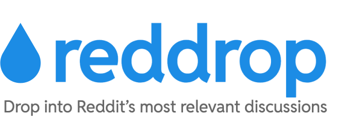

## Overview

Reddit is one of the most powerful platforms for idea exchange, product discovery, and community insight — but it's built in a way that makes strategic participation challenging.

Posts often go unnoticed unless the user already has strong karma or community presence. Many subreddits restrict posting entirely to new users. And while commenting is always an option, finding the right thread, in the right subreddit, with the right tone, is far from simple.

**Reddrop is built to solve that.**

## What It Does

**Reddrop** helps you engage with Reddit more intelligently and effectively — by matching your content with the conversations that matter.

### Key Features:
- ✏️ **Smart Content Analysis**  
  Paste an idea, question, or message — Reddrop understands the core themes.

- 🔍 **Subreddit Discovery**  
  Find the most relevant and high-potential subreddits for your topic.

- 🔥 **Thread Matching**  
  Surface active, high-engagement threads from the past few days that align with your message.

- 🗣️ **Tone Matching**  
  Get guidance on how to adapt your tone and style to fit each subreddit’s culture.

- 📈 **Strategic Insertion**  
  Drop your comments in the places most likely to generate replies, upvotes, and engagement.

## Who It's For

Reddrop is for anyone looking to engage authentically and effectively on Reddit — whether for growth, feedback, or learning:

- 🧠 **Content Creators**  
  Sharing ideas, thought leadership, or creative work with niche communities.

- 🚀 **Startup Founders & Indie Hackers**  
  Introducing products, testing early positioning, or validating market needs.

- 📊 **Marketers & Growth Strategists**  
  Researching audience sentiment, refining messaging, or soft-launching campaigns.

- ✍️ **Writers & Researchers**  
  Looking to test ideas, gather feedback, or spark deeper conversation.

- 🎯 **Community Builders & Brand Ambassadors**  
  Building presence and trust in relevant communities, one comment at a time.

## Why Use Reddrop?

Whether you're launching a product, testing an idea, or just trying to engage more deeply with Reddit's communities, **Reddrop helps you show up in the right places, with the right message, at the right time** — without the guesswork.

## Use Cases

- Founders introducing a product to relevant communities  
- Writers or researchers seeking feedback and discussion  
- Community builders looking to grow presence authentically  
- Anyone who wants to turn Reddit into a high-leverage conversation channel

## Status

Reddrop is in active MVP development. Stay tuned or get in touch if you’d like early access or want to collaborate.

## License

MIT
